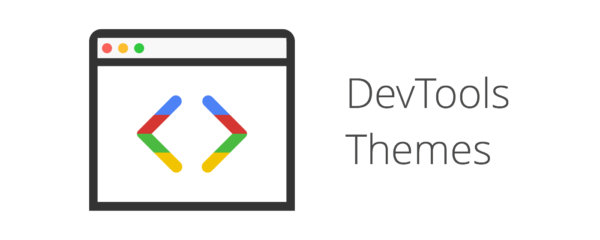

# DevTools Author [](https://travis-ci.org/micjamking/devtools-author)
> A selection of author settings for Chrome Developer Tools.



## Features
If you develop in the browser and/or use Chrome Developer Tools as your web authoring environment, this extension provides a small set of settings to enhance DevTools editing environment:

- Choose from +25 editor themes (applies to [`Elements`, `Sources` and `Console` panels only](https://github.com/micjamking/devtools-author/issues/31))
- Supports system enabled fonts (must be installed prior on your computer).
- Change font size from 10px - 22px

## Usage
1. Install the [Chrome extension](https://chrome.google.com/webstore/detail/devtools-themes/egfhcfdfnajldliefpdoaojgahefjhhi)
2. Enable Developer Tools experiments in `chrome://flags/#enable-devtools-experiments`. Restart Chrome for flags to take effect.
3. Open DevTools (`cmd + opt + I`); *Settings* > *Experiments* > check **Allow custom UI themes**.

After restarting DevTools, you should see the default theme *3024* take affect within the *Sources* and *Console* panels.

## Contributing
[Fork the repository](../../fork) and then follow the steps below to contribute new themes or bug fixes. *Devtools Author* is built using [NodeJS](https://nodejs.org/en/) and [GruntJS](http://gruntjs.com/).

### Installation:
```
$ git clone git@github.com:<username>/devtools-author.git
...
$ cd devtools-author
$ npm install
```

### Development: 
```
$ grunt serve
```
1. Once grunt is running, to install development extension in Chrome, open *Settings* > More Tools > Extensions and click on the **Load unpacked extension...** button. (also enable `Allow incognito` below if you wish).
  - _(Disable DevTools Author if you have the extension installed from the Chrome Web Store.)_
  - Make sure [Developer Tools experiments are enabled and custom UI themes are allowed](#usage).
2. Restart DevTools. I find the fastest way to see changes take affect is to undock DevTools in a separate window and then open a subsequent DevTools window (`cmd + opt + I` while the current DevTools window is focused) after changes have been saved and grunt reloads the assets. You'll then need to reload (close and reopen) the subsequent DevTools window after you make changes.

#### Creating additional themes
1. Make a copy of one of the templates from `app/styles/themes/templates/` and rename the file to your theme name **without the underscore**, ie. if your theme is called *aloha*, inside of `app/styles/themes/`, copy `templates/_theme-template.scss` and rename it to `aloha.scss`
2. Add color values for the palette based on the code syntax highlighter variables in your scss file.
  - If you desire more specific targeting for your theme than what is being supported out of the box, you can add those styles to the end of your theme file, after the `@include styles()`. See [#109](https://github.com/micjamking/devtools-author/issues/109#issuecomment-180145295)
3. Add your color palette object (name and colors array) to the `themes.json` in `app/scripts/`
4. In DevTools, select your theme palette in the *Author Settings* panel.
5. Preview and adjust your colors as needed. See [**Development - Step 2**](#development).
6. Commit and push your changes to your repo, then create a [pull request](../../compare) for your new theme once it is ready!

## Changelog
- [Changelog](CHANGELOG.md)
- [Releases](https://github.com/micjamking/devtools-author/releases)

## License
MIT © Mike King [yo@mikeking.io](mailto:yo@mikeking.io)
